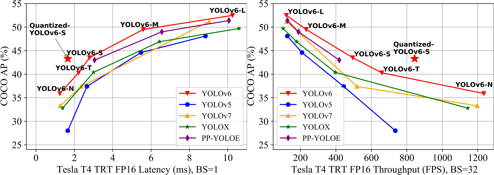

# YOLOv6 概述

  

简体中文 | [English](README.md)

## YOLOv6

官方论文: [YOLOv6: A Single-Stage Object Detection Framework for Industrial Applications](https://arxiv.org/abs/2209.02976)

  

YOLOv6 提供了一系列面向各种工业应用场景的模型，包括微小级(nano)，极小极(tiny)、小(small)，中(medium)，大模型(large)。为更好的实现精度和速度权衡，这些模型的结构会根据模型大小而有所不同。此外，我们还引入了一些策略和技巧方法来进一步提高性能，例如自蒸馏和更多的训练轮次，这些策略和技巧并不会增加模型推理延时。在工业部署时，我们采用通道蒸馏和图优化的量化感知训练来实现极致的推理性能。

YOLOv6-N 在 COCO 数据集上的 mAP 为 35.9% ，在 T4 显卡推理速度可达 1234 FPS。 YOLOv6-S 的 mAP 为 43.5%，推理速度为 495 FPS ，量化后的 YOLOv6-S 模型在 T4显卡 上的 FPS 可以加速到 869，mAP 为 43.3% 。 YOLOv6-T/M/L 也具有出色的性能，与其他检测器相比，我们的模型在基本相同的推理速度时，可以达到更高的精度。

## 本次更新

- 发布了 M/L 模型，并且进一步提高了  N/T/S 模型的性能；⭐️ [精度指标](#Benchmark)
- 将训练速度提高了2倍；
- 修复了 640x640 分辨率推理时性能下降的问题；
- 定制化的模型量化加速方法； 🚀 [量化教程](./tools/qat/README.md)
 ​

